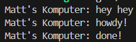
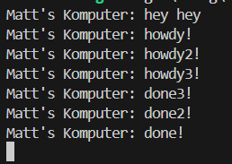

## 1.2 

"hey hey" was printed first because "howdy!" and "done!" is inside an async function. It waits for the timer future for 2 seconds before printing the other lines.

## 1.3

This time there are multiple spawners. It spawns asynchrounously that's why all the 'howdy'-ies are spawned first before all the 'done'-s (there's a sleep for about 2 seconds after each of the 'howdy'-ies are printed). In the end the spawner wasn't dropped that's why the program doesn't finish.